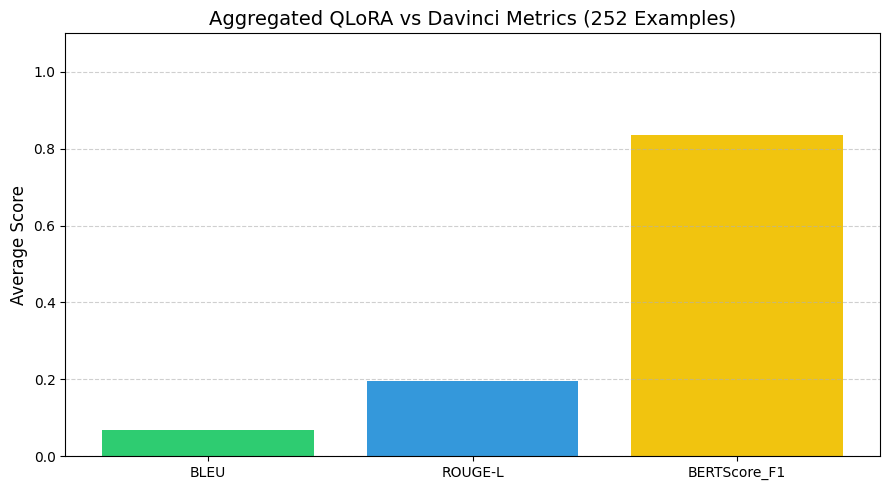
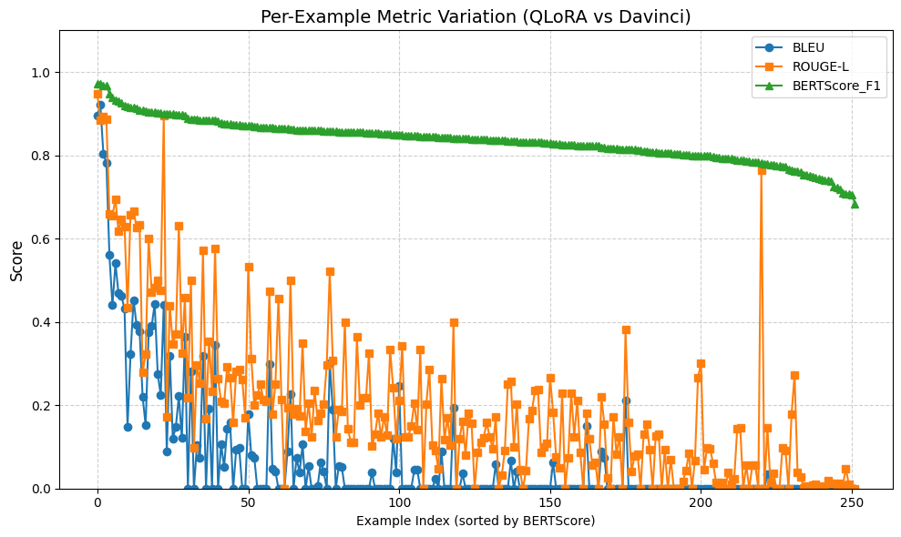
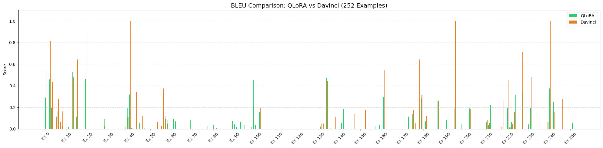
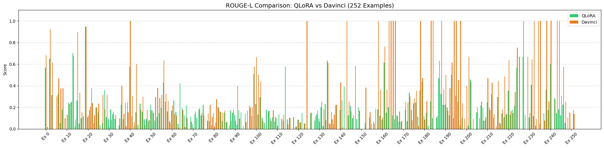
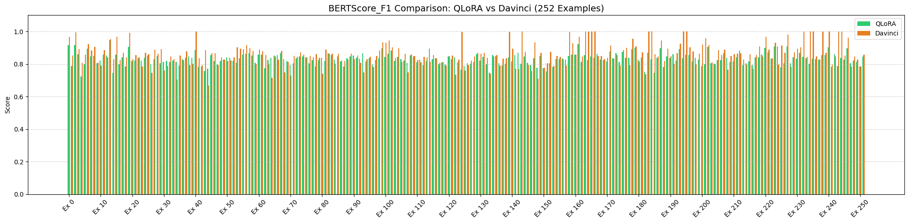

# Self-Instruct: Fine-Tuning Qwen2.5-0.5B with QLoRA

> Reproducing and extending the [Self-Instruct](https://arxiv.org/abs/2212.10560) framework by fine-tuning **Qwen/Qwen2.5-0.5B-Instruct** using **QLoRA (4-bit)** on an 82K instruction dataset, evaluated against OpenAI Davinci on 252 expert-written tasks.

[](https://www.python.org/)
[](Runner.ipynb)
[](https://huggingface.co/Qwen/Qwen2.5-0.5B-Instruct)
[-green)](https://arxiv.org/abs/2305.14314)
[](https://arxiv.org/abs/2212.10560)

---

## Table of Contents

- [Overview](#overview)
- [How Self-Instruct Works](#how-self-instruct-works)
- [Project Pipeline](#project-pipeline)
- [Setup & Installation](#setup--installation)
- [Repository Structure](#repository-structure)
- [Training Configuration](#training-configuration)
- [Evaluation Results](#evaluation-results)
- [Key Observations](#key-observations)
- [Citation](#citation)

---

## Overview

Self-Instruct is a framework for improving a language model's instruction-following ability using its own generated data — without extensive human annotation. Starting from a small seed of 175 human-written tasks, it bootstraps a large instruction dataset using an LLM.

This project:
- **Bootstraps** 500 new machine-generated instructions (25 batches × 20 instructions) using `llama-v3p1-8b-instruct` via the Fireworks API
- **Fine-tunes** `Qwen/Qwen2.5-0.5B-Instruct` on the 82K Self-Instruct dataset using QLoRA (4-bit NF4 quantization)
- **Evaluates** the fine-tuned model on the 252 expert-written Human Eval benchmark from the original Self-Instruct paper
- **Compares** model outputs against OpenAI Davinci predictions using BLEU, ROUGE-L, and BERTScore-F1

---

## How Self-Instruct Works

The Self-Instruct process is an iterative bootstrapping algorithm. Starting from a seed set of manually-written tasks, it prompts an LLM to generate new instructions and corresponding input-output instances. Low-quality or duplicate generations are filtered out, and the resulting data is merged back into the pool. This cycle repeats, growing the instruction dataset with each pass.


*The pipeline for generating instruction data from a language model itself.*

---

## Project Pipeline

```
Seed Tasks (175)
      │
      ▼
 [Step 1] Instruction Bootstrapping
  - 25 batches × 20 instructions/batch
  - Model: llama-v3p1-8b-instruct (Fireworks API)
  - Iterative: each batch merges with previous seeds
  - Output: 500 new instructions → merged with 82K dataset
      │
      ▼
 [Step 2] Instance Generation
  - generate_instances.py on non-classification tasks
  - 388 generation tasks + 1890 classification tasks
  - Total final dataset: 2,275 valid examples
      │
      ▼
 [Step 3] QLoRA Fine-Tuning
  - Base: Qwen/Qwen2.5-0.5B-Instruct
  - 4-bit NF4 quantization (BitsAndBytes)
  - Training subset: 1,000 randomly sampled examples
  - Platform: Google Colab (T4 GPU)
      │
      ▼
 [Step 4] Evaluation on Human Eval (252 tasks)
  - Metrics: BLEU, ROUGE-L, BERTScore-F1
  - Comparison: QLoRA predictions vs. Davinci predictions
```

---

## Setup & Installation

### Prerequisites

- Python 3.10+
- Google Colab (recommended) or a GPU with ≥ 8GB VRAM
- A [Fireworks AI](https://fireworks.ai/) API key (for instruction generation)

### Install Dependencies

```bash
pip install transformers peft trl bitsandbytes datasets accelerate
pip install evaluate rouge_score bert_score matplotlib
```

### Environment Setup

```python
import os
os.environ["FIREWORKS_API_KEY"] = "your_fireworks_api_key_here"
```

### Running the Full Pipeline

All steps are contained in [`Runner.ipynb`](Runner.ipynb). Execute cells in order:

1. **Cell 1** — Set Fireworks API key
2. **Cell 2** — Bootstrap instructions (25 batches via Fireworks LLM)
3. **Cell 3** — Filter classification tasks
4. **Cell 4** — Generate instances for generation tasks
5. **Cell 5** — Merge and clean final dataset
6. **Cell 6** — QLoRA fine-tuning on Qwen2.5-0.5B-Instruct
7. **Cell 7** — Evaluate on 252 Human Eval tasks + visualize

---

## Repository Structure

```
Self-Instruct/
├── Runner.ipynb                        # Main notebook: full pipeline end-to-end
├── README.md
│
├── data/
│   ├── seed_tasks.jsonl                # 175 human-written seed instructions
│   ├── gpt3-generations/
│   │   └── batch_221203/
│   │       └── all_instances_82K.jsonl # Full 82K Self-Instruct dataset
│   └── finetuning/
│       └── self_instruct_221203/       # GPT3 fine-tuning format (prompt + completion)
│
├── self_instruct/
│   ├── bootstrap_instructions.py       # Instruction generation script
│   └── generate_instances.py           # Instance input/output generation
│
├── human_eval/
│   ├── user_oriented_instructions.jsonl  # 252 expert-written evaluation tasks
│   ├── README.md
│   └── predictions/
│       ├── davinci-self-instruct_predictions.jsonl
│       └── qwen05b-qlora-ft_eval_predictions.jsonl
│
├── qwen05b-qlora-ft/
│   └── adapter/                        # Saved LoRA adapter weights
│
└── docs/
    └── pipeline.JPG                    # Self-Instruct pipeline diagram
```

---

## Training Configuration

### Dataset

| Property | Value |
|---|---|
| Source dataset | Self-Instruct 82K (`all_instances_82K.jsonl`) |
| Training subset | 1,000 randomly sampled examples (seed=42) |
| Train / Val split | 950 / 50 (95% / 5%) |
| Classification tasks | 1,890 examples |
| Generation tasks | 388 examples |
| Final cleaned dataset | 2,275 valid examples |
| Avg. input length | 23.2 words |
| Avg. output length | 10.4 words |

### Model & Quantization

| Property | Value |
|---|---|
| Base model | `Qwen/Qwen2.5-0.5B-Instruct` |
| Quantization | 4-bit NF4 (BitsAndBytes) |
| Compute dtype | `float16` |
| Framework | HuggingFace Transformers + PEFT + TRL |

### LoRA Configuration

| Hyperparameter | Value |
|---|---|
| Rank (`r`) | 8 |
| LoRA Alpha | 16 |
| LoRA Dropout | 0.1 |
| Bias | none |
| Target modules | `q_proj`, `k_proj`, `v_proj`, `o_proj` |
| Task type | `CAUSAL_LM` |

### Training Arguments

| Hyperparameter | Value |
|---|---|
| Epochs | 1 |
| Learning rate | 2e-4 |
| Per-device batch size | 1 |
| Gradient accumulation steps | 4 (effective batch size = 4) |
| Optimizer | `paged_adamw_8bit` |
| Mixed precision | fp16 |
| Max sequence length | 1024 (SFTTrainer default) |

### Prompt Format

The model was fine-tuned using the Qwen ChatML format:

```
<|im_start|>system
You are a helpful assistant.<|im_end|>
<|im_start|>user
{instruction}

Input:
{input}<|im_end|>
<|im_start|>assistant
{output}<|im_end|>
```

---

## Evaluation Results

The fine-tuned Qwen2.5-0.5B-QLoRA model was evaluated on all **252 expert-written, user-oriented tasks** from the original Self-Instruct Human Eval benchmark. Model predictions were compared against OpenAI Davinci's outputs using three automatic metrics.

### Aggregated Scores (QLoRA vs. Davinci as Reference)

| Metric | Score |
|---|---|
| **BLEU** | 0.0696 |
| **ROUGE-L** | 0.1961 |
| **BERTScore-F1** | **0.8358** |

> **Note on interpretation:** These metrics treat Davinci's outputs as the reference. Low BLEU/ROUGE-L scores reflect lexical divergence — the fine-tuned model generates semantically valid but differently-worded responses. The high BERTScore-F1 of **0.8358** indicates strong semantic alignment, meaning the model captures the correct meaning even when the surface wording differs.

### Aggregated Metrics Chart



*Average BLEU, ROUGE-L, and BERTScore-F1 across 252 evaluation examples.*

### Per-Example Score Distribution



*Per-example scores sorted by BERTScore-F1 (descending). BLEU and ROUGE-L are sparse and skewed — consistent with open-ended generation tasks where exact n-gram overlap is rare. BERTScore remains consistently high across examples.*

### Side-by-Side Comparison: QLoRA vs. Davinci (252 Examples)

**BLEU**



**ROUGE-L**



**BERTScore-F1**



---

## Key Observations

**BERTScore is the most meaningful metric here.** BLEU and ROUGE-L measure n-gram overlap, which heavily penalizes paraphrasing. Since the model is a 0.5B parameter model fine-tuned on a small 1,000-sample subset for a single epoch, lexical diversity from Davinci is expected. The BERTScore of **0.836** shows the model is semantically on-track.

**Efficient fine-tuning works at scale.** QLoRA with rank-8 LoRA applied to all attention projections (`q`, `k`, `v`, `o`) achieves meaningful instruction-following improvement in a single epoch, training on a T4 GPU in Google Colab — no expensive hardware required.

**Bootstrapping amplifies seed diversity.** The iterative generation pipeline grew from 175 seed tasks to 500+ machine-generated instructions, with each batch feeding the next as new seeds. This progressively diversifies the task pool without manual curation.

**The BLEU/ROUGE gap highlights a known limitation** of reference-based evaluation for open-ended instruction following. Future work could use LLM-as-judge evaluation (e.g., GPT-4 win-rate) for more meaningful quality assessment.

---

## Citation

If you use this work or the original Self-Instruct framework, please cite:

```bibtex
@misc{selfinstruct,
  title={Self-Instruct: Aligning Language Model with Self Generated Instructions},
  author={Wang, Yizhong and Kordi, Yeganeh and Mishra, Swaroop and Liu, Alisa and Smith, Noah A. and Khashabi, Daniel and Hajishirzi, Hannaneh},
  journal={arXiv preprint arXiv:2212.10560},
  year={2022}
}
```

This project extends the Self-Instruct framework using `Qwen/Qwen2.5-0.5B-Instruct` as the base model with QLoRA for efficient 4-bit fine-tuning. The instruction-generation pipeline was reproduced using the Fireworks AI API (`llama-v3p1-8b-instruct`) and evaluated on the 252-task Human Eval benchmark.
